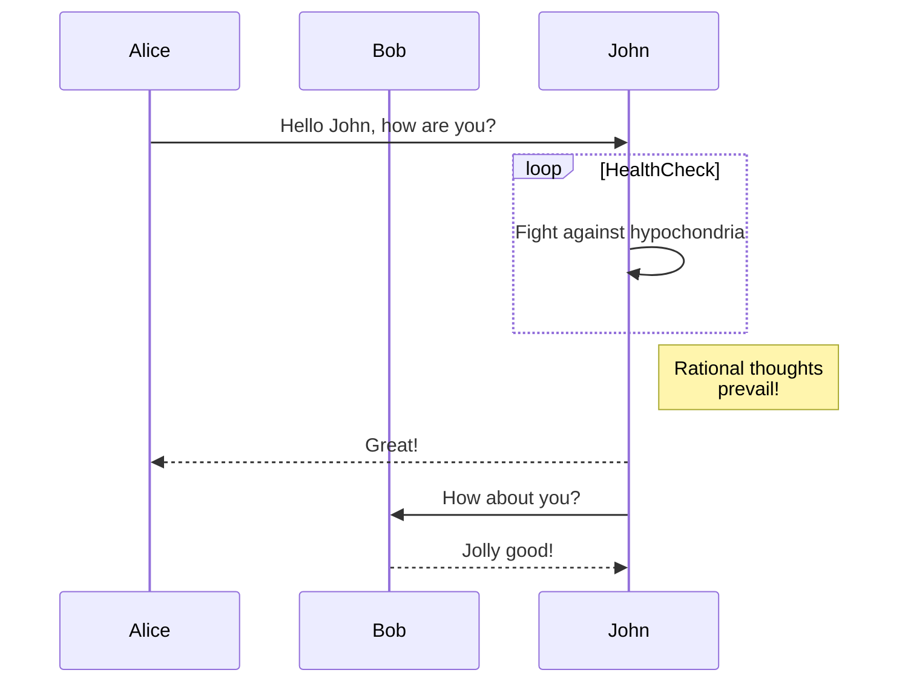
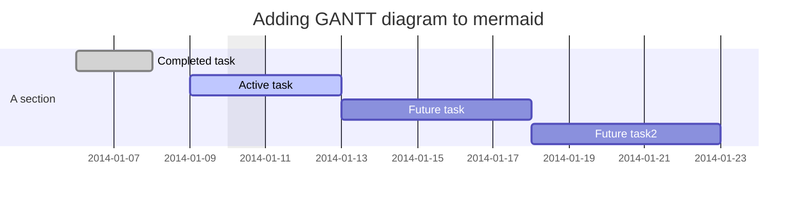
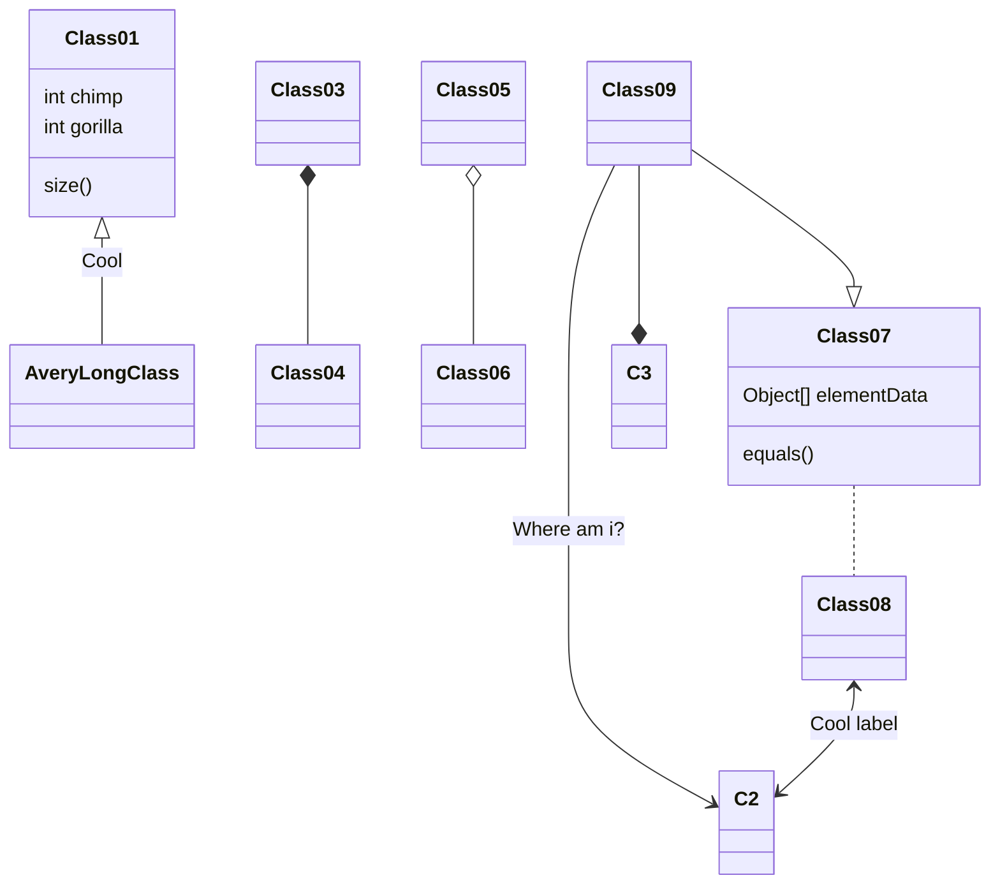
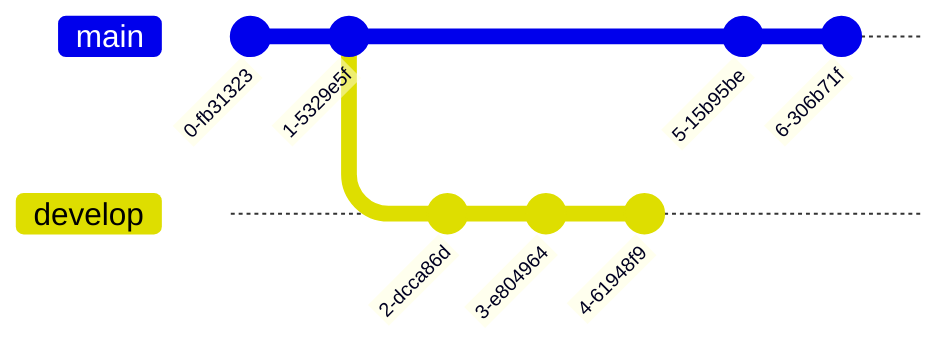
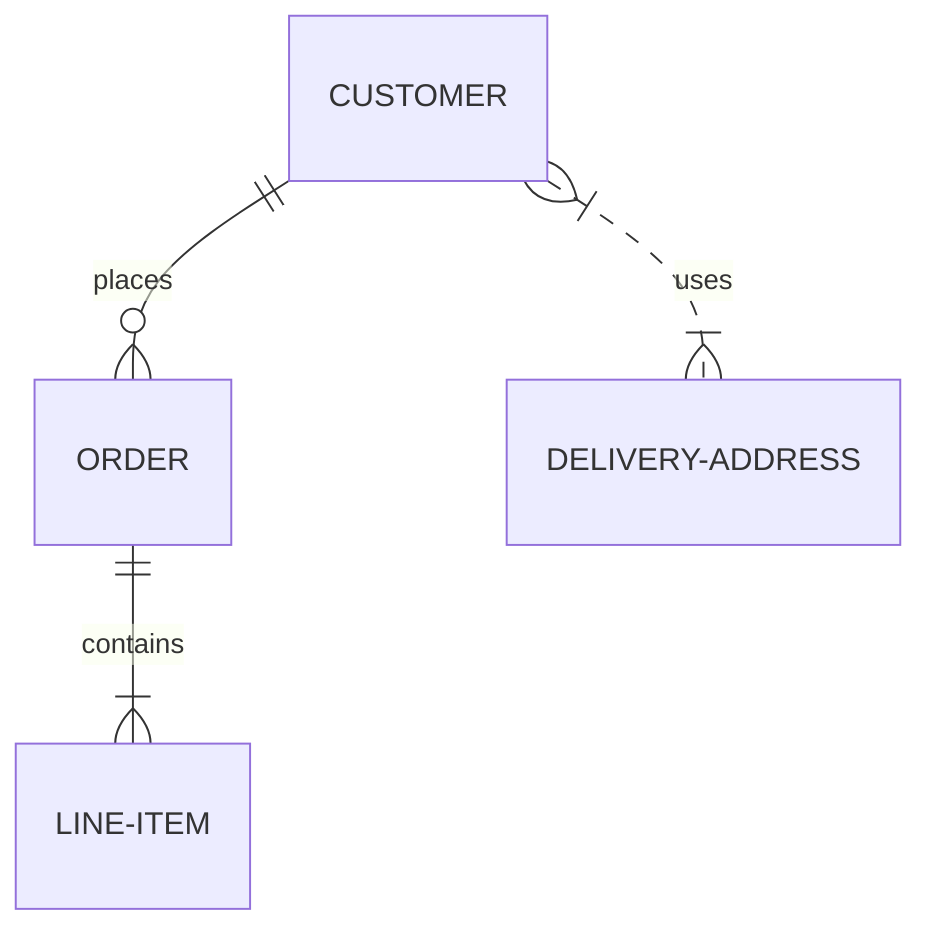
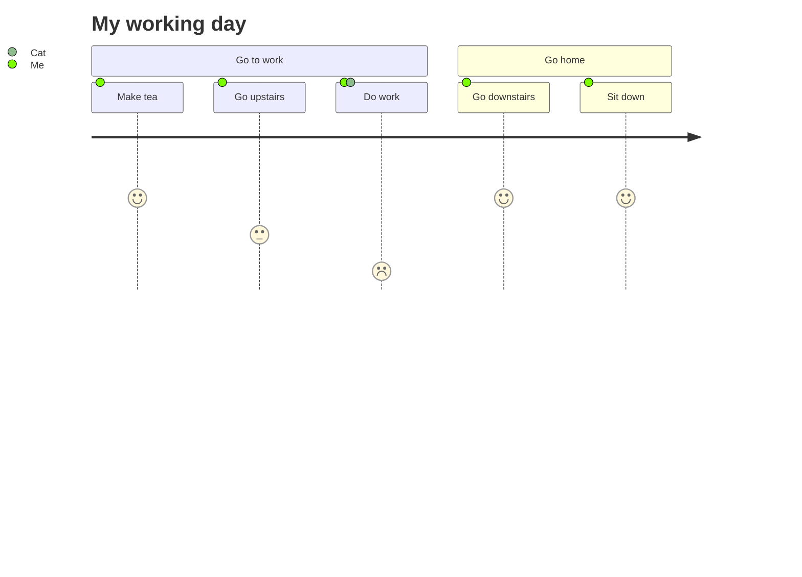
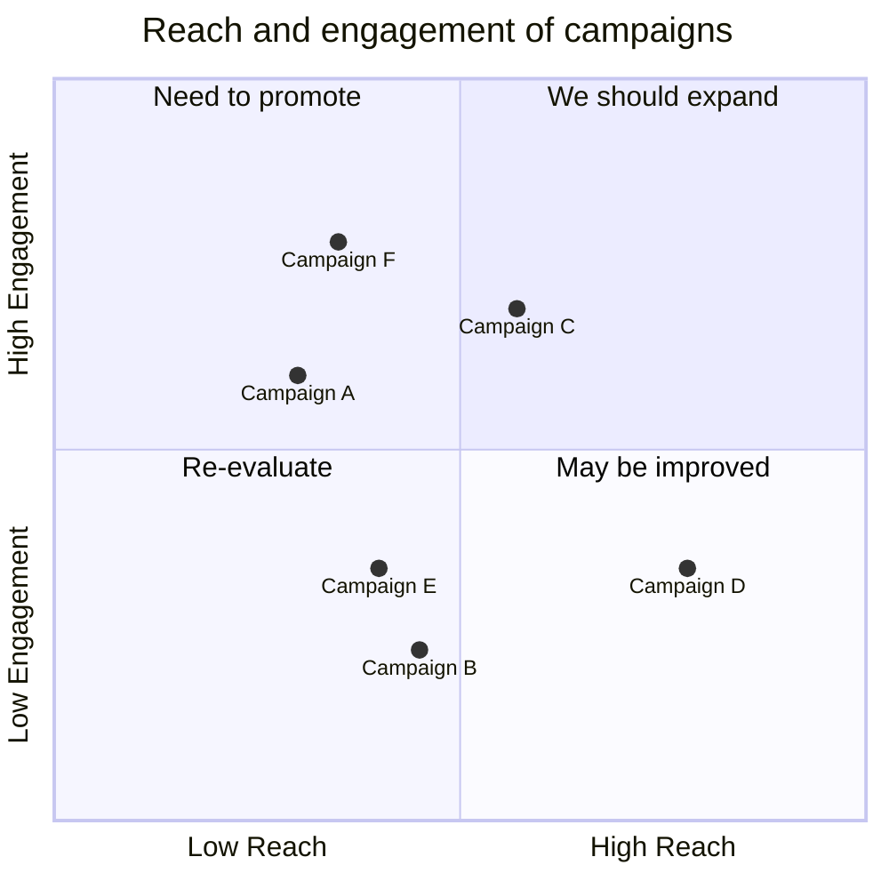
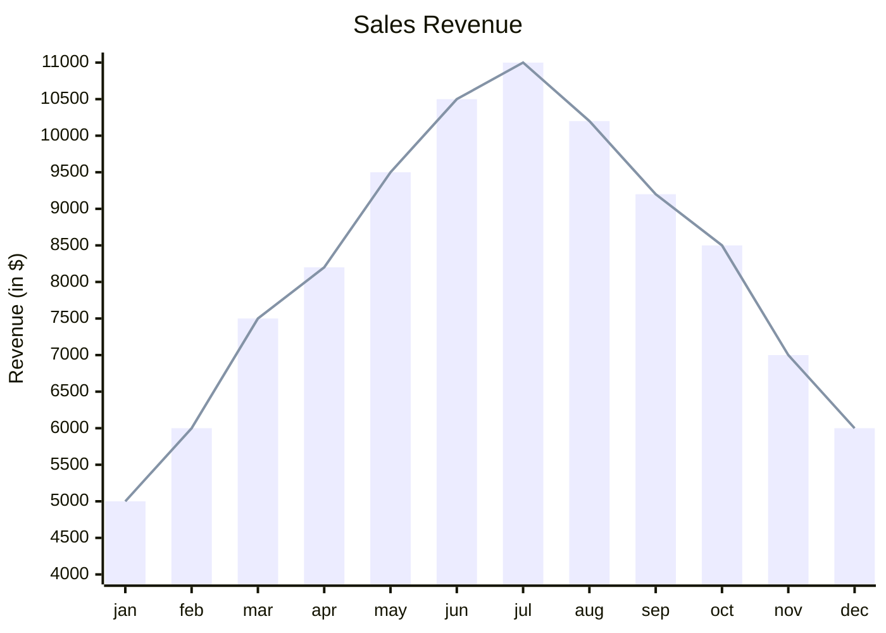

2025-07-09 18:41

Status:

Tags:

---
# Mermaid Syntax - Guide
Mermaid is a Markdown-inspired tool that renders text into diagrams. For example, Mermaid can render flow charts, sequence diagrams, pie charts and more. For more information, see the [](https://mermaid-js.github.io/mermaid/#/).

Mermaid is a JavaScript based diagramming and charting tool that uses Markdown-inspired text definitions and a renderer to create and modify complex diagrams. The main purpose of Mermaid is to help documentation catch up with development.

[Live Examples](https://mermaid.live/)

## Diagram Syntax

Syntax, together with Deployment and Configuration constitute the whole of Mermaid.

### Syntax Structure

All **Diagrams definitions begin** with a declaration of the **diagram type**, followed by the definitions of the diagram and its contents.
This declaration notifies the parser which kind of diagram the code is supposed to generate. The only exception to this a [](https://mermaid.js.org/intro/syntax-reference.html#frontmatter-for-diagram-code) configuration.

Line comments can ignore anything on the line after `%%`.

Unknown words and misspellings will break a diagram, while parameters silently fail.

### Diagram Breaking

One should **beware the use of some words or symbols** that can break diagrams. These words or symbols are few and often only affect specific types of diagrams. The table below will continuously be updated.


|Diagram Breakers|Reason|Solution|
|---|---|---|
|**Comments**|||
|[`%%{``}%%`](https://github.com/mermaid-js/mermaid/issues/1968)|Similar to [Directives](https://mermaid.js.org/config/directives.html) confuses the renderer.|In comments using `%%`, avoid using "{}".|
|**Flow-Charts**|||
|'end'|The word "End" can cause Flowcharts and Sequence diagrams to break|Wrap them in quotation marks to prevent breakage.|
|[Nodes inside Nodes](https://mermaid.js.org/syntax/flowchart.html?id=special-characters-that-break-syntax)|Mermaid gets confused with nested shapes|wrap them in quotation marks to prevent breaking|
### Frontmatter for diagram code

Frontmatter is the term for adding YAML metadata at the start of code. This allows for reconfiguration of a diagram before it is rendered. You can pass metadata Frontmatter with your definition by adding `---` to the lines before and after the definition. This 'triple dash' MUST be the only character on the first line.

Frontmatter uses YAML syntax. It requires any indentation to be consistent and settings are case sensitive. Mermaid will silently ignore misspelling, but badly formed parameters will break the diagram.
```
---
title: Frontmatter Example
displayMode: compact
config:
  theme: forest
gantt:
    useWidth: 400
    compact: true
---
gantt
    section Waffle
        Iron  : 1982, 3y
        House : 1986, 3y

```


## Diagram Types

### [Flowchart](https://mermaid.js.org/syntax/flowchart.html?id=flowcharts-basic-syntax)


 ### [Sequence diagram](https://mermaid.js.org/syntax/sequenceDiagram.html)
 - This looks great for instances where you have 2 or more layers where there multiple to and from actions happens.
 


### [Gantt diagram](https://mermaid.js.org/syntax/gantt.html)


### [Class diagram](https://mermaid.js.org/syntax/classDiagram.html)



### [Git graph](https://mermaid.js.org/syntax/gitgraph.html)


### [Entity Relationship Diagram - ❗ experimental](https://mermaid.js.org/syntax/entityRelationshipDiagram.html)



### [User Journey Diagram](https://mermaid.js.org/syntax/userJourney.html)



### [Quadrant Chart](https://mermaid.js.org/syntax/quadrantChart.html)



### [XY Chart](https://mermaid.js.org/syntax/xyChart.html)




## Deploying Mermaid

To Deploy Mermaid:

1. You will need to install node v16, which would have npm
2. Install mermaid
    - NPM: `npm i mermaid`
    - Yarn: `yarn add mermaid`
    - Pnpm: `pnpm add mermaid`

### [Mermaid API](https://mermaid.js.org/config/setup/README.html):

**To deploy mermaid without a bundler, insert a `script` tag with an absolute address and a `mermaid.initialize` call into the HTML using the following example:**

```
<script type="module">
  import mermaid from 'https://cdn.jsdelivr.net/npm/mermaid@11/dist/mermaid.esm.min.mjs';
  mermaid.initialize({ startOnLoad: true });
</script>
```

**Doing so commands the mermaid parser to look for the `<div>` or `<pre>` tags with `class="mermaid"`. From these tags, mermaid tries to read the diagram/chart definitions and render them into SVG charts.**

---
## References