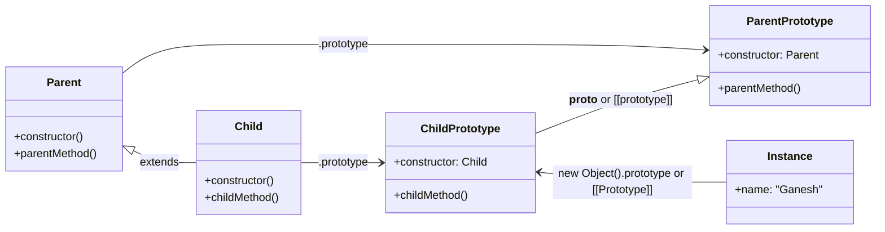

2025-07-15 13:58

Status:

Tags: [[JavaScript]]

---
### Classes

In object-oriented programming, a class is an extensible program-code template for creating objects, providing initial values for state (member variables) and implementations of behavior (member functions or methods).

**Syntax:**

```js
class MyClass {
    constructor(value) { // no comma between constructor and methods
        this.property = value; // Initialize instance properties
        console.log("Constructor called!");
    }
    method1() { // methods
        console.log("Method 1 called!");
    }
    method2() {
        console.log("Method 2 called!");
    }
    method3() {
        console.log("Method 3 called!");
    }
}
```

**To create an object:**

```
const instance = new MyClass("Hello");
// Output: "Constructor called!"
console.log(instance.property); // Output: "Hello"
instance.method1(); // Output: "Method 1 called!"
```
`constructor()` method is called automatically by `new`, so we can initialize the object there.
* **Explanation:** The `constructor` is a special method that gets executed automatically when you create a new instance of the class using the `new` keyword. It's where you typically set up the initial state (properties) of the new object.

In JS, ==a class is a kind of a function.==
* **Explanation:** While `class` provides a more structured and syntactic sugar way to define objects and their prototypes, under the hood, JavaScript classes are still primarily based on constructor functions and prototypes.

**What `class User { ... }` construct really does:**

1.  Creates a function named `User`, that becomes the result of the class declaration. The function code is taken from the `constructor` method (covered empty if we don't write such a method).
2.  Stores class methods in `User.prototype`.
3.  After `new User` object is created, when we call its method, it's taken from the prototype, just as described in the chapter `F.prototype`. So the object has access to class methods.

**We can actually declare the same thing without using class keyword at all:**

```javascript
// Function-based constructor equivalent
function User(name) {
    this.name = name; // Properties are assigned directly to 'this'
}

User.prototype.sayHi = function() {
    console.log(`Hi, my name is ${this.name}`);
};

let user = new User("John");
user.sayHi(); // Output: Hi, my name is John
````

The result is same. Still, there are important *differences*:
- First, a function created by class is labelled by a special internal property `[[IsClassConstructor]]`.
    - ↪️ A class should be called with `new` unlike regular functions.
        - **Explanation:** If you try to call a class constructor without `new` (e.g., `MyClass()`), it will throw a `TypeError`. Regular functions, when called without `new`, have `this` bound to the global object (or `undefined` in strict mode). This internal property enforces the intended use of classes.
        - **Example:**
            ```js
            class TestClass {}
            // TestClass(); // Throws: TypeError: Class constructor TestClass cannot be invoked without 'new'
            ```
            
- Class methods are non-enumerable.
    - ↪️ A class definition sets enumerable flag to `false` for all methods in prototype.
        - **Explanation:** This means that class methods (like `method1`, `method2` in `MyClass.prototype`) will not show up when you iterate over an object's properties using `for...in` loops or `Object.keys()`. This helps keep property enumeration cleaner, focusing on instance data rather than shared methods.
        - **Example:**
            ```js
            class MyExampleClass {
                constructor() { this.data = 'abc'; }
                myMethod() {}
            }
            const exInstance = new MyExampleClass();
            
            for (let key in exInstance) {
                console.log(key); // Output: 'data' (myMethod is not enumerated)
            }
            console.log(Object.keys(exInstance)); // Output: ['data']
            console.log(Object.getOwnPropertyDescriptor(MyExampleClass.prototype, 'myMethod'));
            // Output will show 'enumerable: false'
            ```
            
- Classes always use `use strict`.
    - **Explanation:** All code inside class declarations and class expressions is automatically executed in strict mode, even if you don't explicitly write `'use strict'`. This ensures modern, safer JavaScript behavior within classes.
        
- Similar to named function expressions, class Expressions may have a name.
    ```js
    let user = class MyClass { // class expression with a name 'MyClass'
        sayHi() {
            console.log(MyClass); // MyClass is visible only inside the class expression
        }
    };
    new user().sayHi(); // Output: [class MyClass]
    
    // Anonymous class expression
    let anotherUser = class {
        sayHello() {
            console.log("Hello from anonymous class!");
        }
    };
    new anotherUser().sayHello(); // Output: Hello from anonymous class!
    ```
    
- We can make classes dynamically “on-demand“.
    - **Explanation:** Class expressions allow you to define classes anywhere in your code, including inside functions, and assign them to variables, just like functions.
        
- Just like literal objects, classes may include getters/setters, computed properties.
    - **Getters and Setters:** Allow you to define methods that act like properties, controlling how a property is read and written.
        ```js
        class Circle {
            constructor(radius) {
                this._radius = radius; // Conventionally, _ indicates a private-like property
            }
        
            get radius() { // Getter
                console.log("Getting radius...");
                return this._radius;
            }
        
            set radius(value) { // Setter
                console.log("Setting radius...");
                if (value < 0) {
                    throw new Error("Radius cannot be negative.");
                }
                this._radius = value;
            }
        
            get diameter() {
                return this.radius * 2; // Can use the getter inside the class
            }
        }
        
        const myCircle = new Circle(5);
        console.log(myCircle.radius);    // Output: Getting radius... 5
        myCircle.radius = 10;            // Output: Setting radius...
        console.log(myCircle.diameter);  // Output: Getting radius... 20
        // myCircle.radius = -2; // Throws: Error: Radius cannot be negative.
        ```
        
    - **Computed Properties:** Allow you to use an expression to determine the name of a method or property.
        ```js
        const methodName = "greet";
        
        class Greeter {
            constructor(name) {
                this.name = name;
            }
            [methodName]() { // Computed method name
                console.log(`Hello, ${this.name}!`);
            }
            ['get' + 'Name']() { // Another computed property example
                return this.name;
            }
        }
        
        const greeter = new Greeter("World");
        greeter.greet();      // Output: Hello, World!
        console.log(greeter.getName()); // Output: World
        ```
        

### Class inheritance

Class inheritance is a way for one class to extend another class, so we can create new functionality on top of existing ones.

`extends`
↪️class Child extends Parent



- ↪️ `extends` allows any expression after it.
    - **Explanation:** ==You can extend not just a class name, but any expression that evaluates to a constructor function or `null`.==  This allows for dynamic inheritance.
    - **Example:**
        ```js
        function getParentClass(condition) {
            return condition ? class A { sayHi() { console.log('Hi A'); } } : class B { sayHi() { console.log('Hi B'); } };
        }
        
        class DynamicChild extends getParentClass(true) { // Extends class A
            // ...
        }
        new DynamicChild().sayHi(); // Output: Hi A
        
        class AnotherDynamicChild extends getParentClass(false) {//Extends class B 
            // ...
        }
        new AnotherDynamicChild().sayHi(); // Output: Hi B
        ```

#### .super
- `super(...)` to call a parent constructor (inside our constructor only)
- `super.method(...)` to call a parent method.
    - **Explanation:** `super` is a special keyword used in derived classes to refer to the parent class.
        - When used as a function (`super()`), it calls the parent class's constructor. This _must_ be done before `this` can be used in the derived class's constructor.
        - When used as an object (`super.method()`), it allows you to call a method defined on the parent class's prototype.

> Arrow functions have no `super` or `this`, so they transparently fall into the surrounding context.
- **Explanation:** This means if an arrow function is defined within a class method, `this` and `super` inside the arrow function will refer to the `this` and `super` of the _enclosing_ method, not the arrow function itself. This is often convenient for callbacks.

 **Overriding a method**

```js
class Animal {
    constructor(name) {
        this.name = name;
    }
    speak() {
        console.log(`${this.name} makes a sound.`);
    }
}

class Dog extends Animal {
    constructor(name, breed) {
        super(name); // Call parent constructor
        this.breed = breed;
    }
    speak() { // Overriding the speak method
        super.speak(); // Call the parent's speak method
        console.log(`${this.name} barks!`);
    }
    fetch() {
        console.log(`${this.name} fetches the ball.`);
    }
}

const myDog = new Dog("Buddy", "Golden Retriever");
myDog.speak();
// Output:
// Buddy makes a sound.
// Buddy barks!
```

 **Overriding a Constructor (inside our constructor only)**

```js
class Parent {
    constructor(value) {
        this.parentValue = value;
        console.log("Parent constructor called with:", value);
    }
}

class Child extends Parent {
    constructor(value, extra) {
        super(value); // Must call super() before using 'this'
        this.childExtra = extra;
        console.log("Child constructor called with extra:", extra);
    }
}

const childInstance = new Child("parent data", "child data");
// Output:
// Parent constructor called with: parent data
// Child constructor called with extra: child data
console.log(childInstance.parentValue); // Output: parent data
console.log(childInstance.childExtra);  // Output: child data
```

If a class extends another class and has no constructor, then the following "empty" constructor is generated:

```js
constructor(...args) {
    super(...args);
}
```

Constructor in inheriting classes must call `super()` and (1) do it before using `this`.
- **Explanation:** This is a strict rule in JavaScript. In a derived class's constructor, you _must_ call `super()` first. This is because the `super()` call is responsible for initializing `this` in the derived class by invoking the parent constructor. If you try to use `this` before `super()`, you'll get a `ReferenceError`.    

In JS, a derived constructor has an inherent property `[[ConstructKind]]`: "derived".

That label affects its behavior with new:
- When a regular function is executed with `new`, it creates an empty object & assigns `this` to it.
- When derived constructor runs, it doesn't do this, it expects parent constructor to do this job.
    - **Explanation:** This is the core reason for the `super()` requirement. A derived constructor doesn't create its own `this` binding initially. It relies on the parent constructor (called via `super()`) to create and return the `this` object that the derived constructor will then extend.
- So a derived constructor must call `super` in order to execute its parent (base) constructor, otherwise the object (`this`) won't be created and we'll get an error.

The parent constructor will always use its own field value, not the overridden one (derived field).
- ↪️ Even when parent constructor is called in derived class, it uses the overridden method.
    - **Clarification:** This point can be a bit tricky. When `super()` is called, the parent's constructor is executed in the context of the _newly created instance_ (which is a `Child` instance).
    - If the parent constructor calls a method that is _overridden_ in the child class, then the _child's version_ of that method will be executed. This is due to the way `this` works and the prototype chain. The `this` inside the parent constructor, when called via `super()`, refers to the `Child` instance.
        
    - **Example to clarify:**
        ```js
        class Base {
            constructor() {
                console.log("Base constructor. Calling getInfo():");
                this.getInfo(); // Calls the method on 'this'
            }
            getInfo() {
                console.log("From Base: Base Info");
            }
        }
        
        class Derived extends Base {
            constructor() {
                super(); // Calls Base constructor
                console.log("Derived constructor.");
            }
            getInfo() { // Overridden method
                console.log("From Derived: Derived Info");
            }
        }
        
        new Derived();
        // Output:
        // Base constructor. Calling getInfo():
        // From Derived: Derived Info  <-- The overridden method is called!
        // Derived constructor.
        ```
        - This demonstrates that when a method is called on `this` within the parent constructor (which is invoked by `super()`), if that method is overridden in the derived class, the _derived class's version_ of the method is used. The original note's wording "The parent constructor will always use its own field value, not the overridden one (derived field)" might be interpreted differently, so the example clarifies the actual behavior for methods. For _properties_ directly assigned in the constructor, the parent's assignment will be overridden by the child's if they share the same name.
            

Methods remember their class/object in the internal `[[HomeObject]]` property.
- ↪️ That's how `super` resolves parent methods.
    - **Explanation:** The `[[HomeObject]]` internal property points to the object that holds the method. When `super.method()` is called, JavaScript uses `[[HomeObject]]` to find the prototype of the current method's class, and then looks up the method on _that_ prototype, effectively finding the parent's version.

### Static methods

Static methods are used for the functionality that belongs to the class "as a whole". It doesn't relate to a concrete class instance (object).
- **Explanation:** Static methods are called on the class itself, not on instances of the class. They are useful for utility functions that don't need access to instance-specific data, or for factory methods that create instances.


```js
class Article {
    static compare(articleA, articleB) {
        return articleA.title.length - articleB.title.length;
    }

    constructor(title) {
        this.title = title;
    }
}

const article1 = new Article("Short Title");
const article2 = new Article("A Much Longer Title");

console.log(Article.compare(article1, article2)); // Correct usage: -10 (or similar, depending on lengths)
// new Article().compare(); // Incorrect: TypeError: new Article(...).compare is not a function
```

They are labelled by the word `static` in class declaration.

### Static properties

Static properties are used when we'd like to store class-level data, also not bounded to an instance.

- **Explanation:** Similar to static methods, static properties belong to the class itself. They are useful for constants, configuration values, or counts that are shared across all instances of the class.
    

**Syntax:**

```js 
class MyClass {
    static property = 1; // Static property

    static method() { // Static method
        console.log("Static method called. Static property:", MyClass.property);
    }

    instanceMethod() {
        console.log("Instance method called. Cannot directly access static property 'property' with 'this.property'. Use MyClass.property:", MyClass.property);
    }
}

console.log(MyClass.property); // Output: 1
MyClass.method();             // Output: Static method called. Static property: 1

const instance = new MyClass();
// console.log(instance.property); // undefined (instance does not have this property)
instance.instanceMethod(); // Output: Instance method called. Cannot directly access static property 'property' with 'this.property'. Use MyClass.property: 1

// Same as (old way of adding static properties/methods):
// MyClass.property = 1;
// MyClass.method = function() { ... };
```

### Class Expressions
```js
let User = class MyClass { // class expression name

sayHi() {

alert(MyClass);

}

};
```
Similar to named function expressions, class expressions may have a name.
- **Explanation:** The name `MyClass` in `let User = class MyClass { ... }` is local to the class expression itself. It allows the class to refer to itself internally (e.g., for recursion or static method calls within the class), but the variable `User` is what holds the class reference externally.

We can make classes dynamically (on-demand).
- **Explanation:** This reiterates that class expressions are values that can be assigned, passed around, and returned from functions, making them very flexible.
    
Just like literal objects, classes may include getters/setters, computed properties, etc.
- **Explanation:** This is a summary point, covered with examples earlier, reinforcing that these features are available in class syntax.
    

Class fields is a syntax that allows to add any properties.
- ↪️ They are set on individual objects, not `User.prototype`.
    
    - **Explanation:** Class fields (also known as public class fields) are a modern syntax for declaring instance properties directly within the class body. Unlike methods, which go on the prototype, class fields are added directly to each instance when it's created. This simplifies property initialization, especially for properties that don't need to be passed through the constructor.
        
    - **Example:**
        
        ```js
        class UserWithFields {
            name = "Guest"; // Public class field (instance property)
            #privateId = Math.random(); // Private class field (starts with #)
        
            constructor(name) {
                if (name) {
                    this.name = name; // Overrides default 'Guest' if provided
                }
                // this.name is already defined by the field
            }
        
            greet() {
                console.log(`Hello, ${this.name}! My ID is ${this.#privateId}`);
            }
        }
        
        const user1 = new UserWithFields();
        user1.greet(); // Output: Hello, Guest! My ID is 0.xxxx
        
        const user2 = new UserWithFields("Alice");
        user2.greet(); // Output: Hello, Alice! My ID is 0.xxxx
        
        // console.log(user1.#privateId); // SyntaxError: Private field '#privateId' must be declared in an enclosing class
        ```
---
## References
[[Prototype - Javascript]]